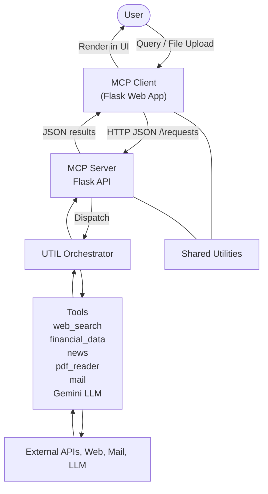

# AutoInvestigator: Multi-Agent AI System for Corporate Risk Intelligence

AutoInvestigator is an agentic AI system built using the MCP Server + MCP Client architecture. It automates corporate risk analysis by coordinating agents that perform web research, financial analysis, sentiment tracking, and risk reporting.

## Modules
- **MCP Server**: Hosts tools (web search, PDF reader, sentiment analyzer), resources (memory, knowledge base), and prompt templates.
- **MCP Client**: Coordinates multi-agent workflows that accomplish tasks like risk profiling, news analysis, and financial insight.
- **Shared**: Utilities and configurations.
- **Data**: Stores cache and generated reports.

## Architecture

The user interacts with the **MCP Client**, a Flask-based web interface that
handles authentication, verification, and investigative queries. Requests are
sent as structured JSON to the **MCP Server**, which routes them through the
`UTIL` orchestrator. This component invokes specialized tools—such as web
search, financial data retrieval, news scanning, PDF analysis, email
notifications, and a Gemini-powered LLM—to gather external information. Results
flow back through the server to the client interface, where they are presented
to the user. Shared utilities provide configuration and helpers used across
both sides of the system.

