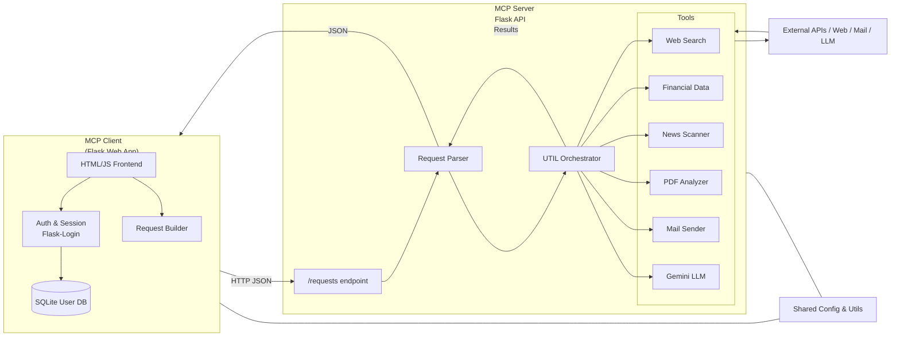

# AutoInvestigator: Multi-Agent AI System for Corporate Risk Intelligence

AutoInvestigator is an agentic AI system built using the MCP Server + MCP Client architecture. It automates corporate risk analysis by coordinating agents that perform web research, financial analysis, sentiment tracking, and risk reporting.

## Modules
- **MCP Server**: Hosts tools (web search, PDF reader, sentiment analyzer), resources (memory, knowledge base), and prompt templates.
- **MCP Client**: Coordinates multi-agent workflows that accomplish tasks like risk profiling, news analysis, and financial insight.
- **Shared**: Utilities and configurations.
- **Data**: Stores cache and generated reports.

## Architecture



The user interacts with the **MCP Client**, which combines a browser-based UI,
authentication powered by Flask-Login, and a small request builder that shapes
investigation tasks into the JSON format expected by the server. User
credentials and session data live in a local SQLite database.

Requests are POSTed to the server's `/requests` endpoint where a parser unwraps
each request and passes it to the `UTIL` orchestrator. `UTIL` dispatches calls
to individual tools: web search, financial data retrieval, news scanning,
PDF report analysis, email notifications, and a Gemini-based LLM. Tools reach
out to external APIs, the web, or mail services as needed and send their
responses back through `UTIL`.

The server also exposes an `/upload-pdf` route for direct document analysis.
All results are aggregated into a JSON response and returned to the client for
rendering. Configuration values and helper utilities in the `shared` package
are imported on both sides to provide consistent settings and common
functionality throughout the system.

## Running Locally

1. Install dependencies:
   ```bash
   pip install -r requirements.txt
   ```
2. Provide API keys by setting environment variables (e.g., `GEMINI_KEY`, `GOOGL_SEARCH_KEY`, `CSE`) or creating a `.env` file.

3. Launch the full stack (API server + web UI):
   ```bash
   python run_web_app.py
   ```
   This starts the API server at http://localhost:8000 and the web interface at http://localhost:5000.

To run the components separately:
```bash
# Terminal 1
SERVER_PORT=8000 python server.py

# Terminal 2
python run_web_app.py

```
